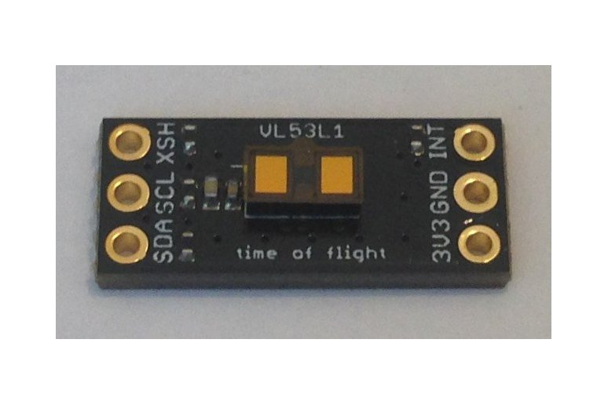

<a href="https://www.tindie.com/products/onehorse/vl53l1-long-range-proximity-sensor"></a>

This library derives from the 
[VL53L1X ULD API](https://www.st.com/en/embedded-software/stsw-img009.html), q.v. for details.

The library has two three important features:

1. Multi-platform

2. Header-only

3. Extremely simple: just ```begin()``` and ```readDistance()``` methods

Using the [Pesky Products Vl53L1 sensor](https://www.tindie.com/products/onehorse/vl53l1-long-range-proximity-sensor)
I have tested this library with the following MCUs:

* [Teensy 4.0](https://www.pjrc.com/store/teensy40.html)

* [Dragonfly STM32L4](https://www.tindie.com/products/tleracorp/dragonfly-stm32l47696-development-board)
  
* [TinyPICO ESP32](https://www.tinypico.com/)

* [Adafruit Feather STM32F405 Express](https://www.adafruit.com/product/4382)

* [RaspberryPi 3](https://www.raspberrypi.com/products/raspberry-pi-3-model-b/)
